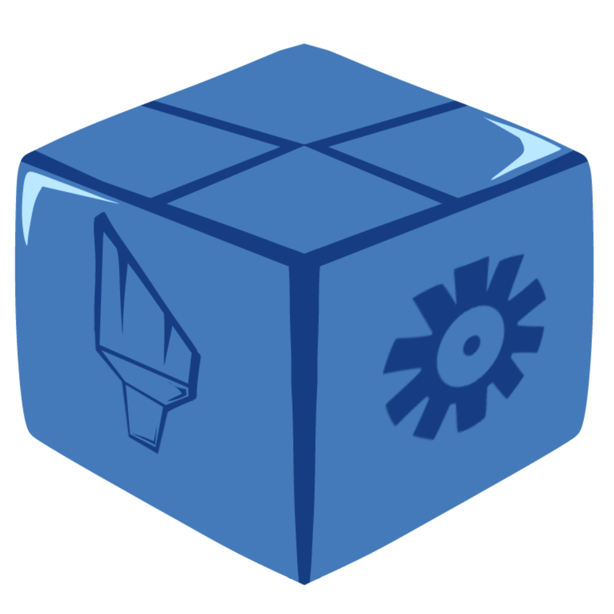

<!-- markdownlint-disable MD041 MD033 -->

    

        
    

    

        <ul style="list-style: none;">
            

                <h1>Konfique</h1>
            

        </ul>
    

**Konfique** is a package configuration system developed by Cayla for Ballsdex versions that predate v3, allowing package developers to implmement simple package configuration.

### Contributors

- `@cayla.py` - Package developer
- `@hersh492` - Logo designer
